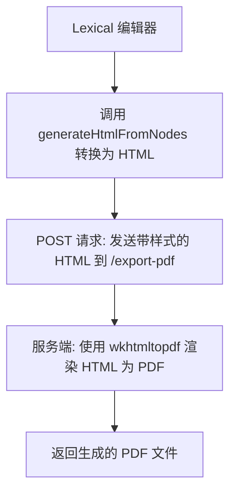

# 背景
想要将富文本文档导出，现有方案使用 html2canvas + jspdf 导出，但是发现有很多缺陷和弊端如分页可能割裂文字，表格导出不友好，文档太大会导致浏览器内存不足导致导出空白内容。

原因：
- html2canvas 只能把 HTML 渲染成一张 bitmap 图片，导致分页、文字割裂、表格不友好、体积大、模糊、内存占用高。
- jsPDF 的核心是基于 Canvas 的图像写入，并不是真正的 PDF 排版引擎。

当前用户对于分页、表格布局等有要求，而这些问题正是当前方案本身的局限性导致的，所以要解决这些问题，通常需要换一种思路：不是“截图”，而是把 HTML/CSS 转换为真正的 PDF 排版指令。

对于大文档来说 前端 + 后端 方案更合适
1. wkhtmltopdf（成熟稳定）
- 基于 WebKit，把 HTML/CSS（含表格、分页、字体）完整渲染成 PDF。
- 支持分页控制（page-break-before、page-break-after）。

缺点：依赖服务端二进制。

你现在的场景是：

前端：Lexical 编辑 + 预览（渲染为 HTML）。

后端：Golang。

目标：导出 PDF，且导出的样式要和预览尽量一致。

## wkhtmltopdf 在 Go 服务端的使用

wkhtmltopdf 是一个独立的命令行工具，Golang 可以通过库或直接执行命令来调用它。

## 前端调用方式

1. Lexical 编辑器 → $generateHtmlFromNodes 转换为 HTML。
2. 把 HTML（带样式）POST 给 /export-pdf。
3. 服务端用 wkhtmltopdf 渲染成 PDF 并返回。

这样就能保证 PDF 和前端预览几乎完全一致（因为 wkhtmltopdf 是用 WebKit 渲染 HTML+CSS）。

验证 html + css 是否跟预览时一致

